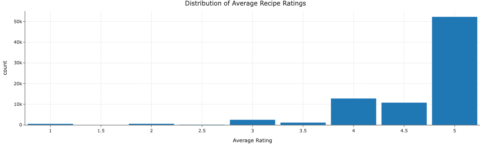

## Recipes and Data

# Introduction
This dataset is based off recipes and their ratings/reviews posted on food.com since 2008. There are two datasets, recipes and ratings, which we are combining to create one big dataset which contains information for 81,173 recipes. This vast dataset gives us a great way to predict a recipe's ratings (which is the average rating column we created) based on numerous columns in our combined dataset like 'minutes' (amount of time to prepare a recipe), 'nutrition' (nutrition information of a recipe in the form of an array including its calories, total fat, sugar, sodium, protein, saturated fat, and carbohydrates), 'n_steps' (number of steps of a recipe) and 'n_ingredients' (the number of an ingredients needed for a recipe). This well help us understand which qualities are more or less useful in getting good rated recipes, meaning if someone wants good reviews to the recipe online, they know what factors would most influence their recipe's ratings. 

---

## Data Overview

### Data Cleaning
Firstly, since we are originally two datasets, we did a left merge on between the datasets recipes and ratings. In our merged dataset, we replaced all ratings that contained a 0 with 'np.nan' as the number 0 may indicate a person gave a review without giving an official rating, messing up a recipe's average rating as a result. We than created a new column called 'average_rating' to give a recipes average rating, which is helpful to our analysis as that is what we are investigating. We then dropped duplicate recipes with the same id, as we got our average rating per recipe, which is enough. 

Furthermore, we have to split the column 'nutrition' into 7 different columns containing the values for a recipe's calories, total fat, sugar, sodium, protein, saturated fat, and carbohydrates. This was easy as we just pieced apart an array and created a new column for each nutrition value. 

We then removed the columns 'id', 'contributor_id', 'nutrition', 'steps', 'tags', 'ingredients', 'submitted', 'description', 'user_id', 'recipe_id', 'date', 'rating', and 'review' as these columns aren't neccessary for our analysis. We also drop any rows containing 'nan' values at this point as well.

We then got a dataframe cleaned for our analysis. Here is a look at its head below:

| | name  | minutes | n_steps | n_ingredients | average_rating | calories | total fat | sugar | sodium | protein | saturated fat | carbohydrates |
|-------|-------|---------|---------|----------------|----------------|----------|------------|--------|--------|---------|----------------|----------------|
| 0     | 1 brownies in the world best ever | 40 | 10 | 8 | 4.0 | 138.4 | 10.0| 50.0 | 3.0 | 3.0 | 19.0 | 6.0 |
| 1     | 1 in canada chocolate chip cookies | 45| 12 | 5 | 5.0 | 595.1 | 46.0 | 211.0 | 22.0 | 13.0 | 51.0  | 26.0 |
| 2     | 412 broccoli casserole  | 40 | 6 | 9  | 5.0  | 194.8  | 20.0| 6.0 | 32.0  | 22.0 | 36.0 | 3.0 |
| 6     | millionaire pound cake  | 120 | 7 | 12 | 5.0 | 878.3 | 63.0 | 13.0 | 326.0 | 20.0 | 123.0 | 39.0 |
| 7     | 2000 meatloaf | 35 | 90 | 17 | 5.0 | 267.0 | 12.0 | 30.0 | 12.0 | 29.0 | 48.0 | 2.0 |

### Univariate Analysis
---
Below is a histogram giving a distribution of our average ratings. This is important as this is what we trying to estimate based on other predictors and it's good to know what ratings are more common and what ratings are rare. In this case, an average rating of 5 is by far the most common and the distribution is heavily skewed left, making it probably harder to predicate a rating as a result.

### Bivariate Analysis
---
Below is a scatterplot between the a recipe's calories and its number of steps. This is important as we need to check for relationships between the predictors to check for factors like collinearity. In this case, the recipes with fewer steps seem to have a wider range of calories while recipes that take more steps seem to have not so high calories. The scatterplot doesn't appear to show any clear linear relationship between the two variables. 

### Interesting Aggregates
---

### Imputation
I didn't impute any values in our dataframe. This is due to the fact that different recipes have different values for its nutrition profile and its time needed, which is why we can't really get a good idea of what to replace for a specific recipe's 'nan' value. So, instead, we just removed them from our dataframe.

---

# Problem Identification
Our prediction problem is trying to predict the average rating of a recipe based. This would be a regression problem as the average rating of a recipe is a continous quantitve variables. Even though it is bounded between 1 and 5, it can be any rational number inside that range, meaning there are an infinite amount of average ratings possible for a recipe. Thus our response variable here is the average rating, which will help us identify how well recieved a recipe is from people trying it and rating it. 

Our predictors used to predict the average rating of a recipe is a recipe's number of ingredient, number of steps, the time it takes in minutes, and its nutrition statistics. These predictors will be known before a recipe is posted online, so it makes sense to use them to determine what a recipe's average rating would be when it gets posted online. 

We will use MSE (mean squared error) to evaluate our model as it works well in pointing large errors in our model.  MSE is the best metric to use generally for linear models, which is why we chose them over other metrics like MAE (mean absolute error). 

---

# Baseline Model

---

# Final Model

---

### GitHub & Sources
